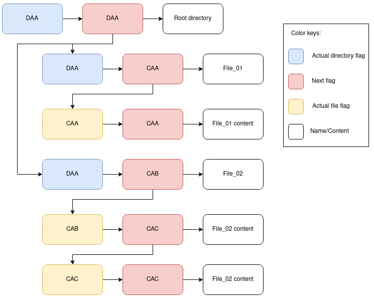

# Turtle FS

This project was developed during an undergraduate program with the purpose of studying filesystems and C programming language. This project creates a file and uses it as a filesystem creating files and directories inside through a command line interface

## Getting Started

This project creates a virtual HD with the size of 32 Mb by default and also it's architecture was planned from zero. It's not based on FAT, NTFS, ext4 or any kind of existing filesystem.

### Understanding how this FS works

Filesystems has blocks and those blocks have sizes, those kind of info were provided to the code in [globais.c](https://github.com/phsmoura/turtle-fs/blob/master/globais.c), here variables like the size of the blocks and quantity of blocks were defined. By default this virtual HD has 32 bytes per block and it's created with 1000 blocks.

When the HD is created it will have a root directory in the first block an the rest will have the null char "\", this char was chosen just to use an alternative char besides "\0" and manipulate the filesystem with it, in fact "\0" represents the end of the line in this FS. It's also possible to change the null char in [globais.c](https://github.com/phsmoura/turtle-fs/blob/master/globais.c).

The ideia of this project is that the filesystem always has 2 flags as reference, one for directory and one for file. Those flags are represented by 3 characters, one of them being for directory or file identification, respectively, the chars "C" and "D". The flags are written to the virtual hard drive along with the directory or file and occupy 6 bytes, 3 bytes representing the current flag and 3 bytes representing the next flag referring to the directory or file.

Now, take a look at the visual representation of the fs block after creating the hd file:

| Actual flag | Next flag | Content/Name |
|---|---|---|
| DAA | DAA | root |

Ok, so that's what the 1st block of the filesystem will have and the rest of the blocks will have the null char. Let's add two files to that example, *_file_01_* and *_file_02_*. Imagine that *_file_01_* has a content that fits in one block and *_file_02_* has a bigger content needing two blocks. This is what will happen:

| Actual flag | Next flag | Content/Name |
|---|---|---|
| DAA | DAA | root |
| DAA | CAA | file_01 |
| CAA | CAA | 111111111\0 |
| DAA | CAB | file_02 |
| CAB | CAC | 22222222222222222222222222 |
| CAC | CAC | 2222222222\0 |

Here the logic of how it was built starts to show it's face, starting from root directory the system holds the **"actual flag"** on the memory and reads the the **"next flag"** to see if the directory will change and if it doesn't it will hold the file referece flag on the memory too and look for it in another block to show its content and also checks the **"next flag"** of this new block. When the **"actual flag"** and the **"next flag"** are the same, means that the content doesn't extend to another block.



As shown in the diagram, the flag is a pointer? The answer is *_"No, it isn't!"_*, the flags may behave like a pointer, but they are only chars that keeping being compared with *_"strcmp()"_*. That kind of implementation occupy a lot of space and takes a lot of time, which means that this filesystem is too slow! That's why it's called *_turtle fs_*.

What if a directory was added and inside that new directory a 3rd file was created? The tree structure would be that:

```bash
root/
├── dir_01
│   └── file_03
├── file_01
└── file_02
```

This is how the blocks would look like:

| Actual flag | Next flag | Content/Name |
|---|---|---|
| DAA | DAA | root |
| DAA | CAA | file_01 |
| CAA | CAA | 111111111\0 |
| DAA | CAB | file_02 |
| CAB | CAC | 22222222222222222222222222 |
| CAC | CAC | 2222222222\0 |
| DAA | DAB | dir_1 |
| DAB | CAD | file_03 |
| CAD | CAD | 33333333\0 |

So far just the creation was demonstrated, what would happen if *_file_02_* was deleted? The blocks that were used by that file would be filled with the null char and the flag referece still would be counting forward. This is how the blocks would be like:

| Actual flag | Next flag | Content/Name |
|---|---|---|
| DAA | DAA | root |
| DAA | CAA | file_01 |
| CAA | CAA | 111111111\0 |
| DAA | DAB | dir_1 |
| DAB | CAD | file_03 |
| CAD | CAD | 33333333\0 |

## Prerequisites

In order to compile the project and see its running:

1. Open [globais.c](https://github.com/phsmoura/turtle-fs/blob/master/globais.c) and change the variables below to hold the path where the virtual hds will be stored.

    ```c
    char diretorio[] = "/<desired path>"
    const char reseta_dir [] = "/<desired path>"
    ```

2. For those using Ubuntu or debian like distribuitions, install gcc and make through *_"build-essesntial_* package

    ```bash
    $ sudo apt update
    $ sudo apt install build-essential
    $ sudo apt-get install manpages-dev
    ```

## Running the code

Time to compile the project!

1. Run make command to generate the executable file

    ```bash
    $ make install
    ```

2. Run the executable, get inside the fs and interact with it through the CLI.

    ```bash
    $ ./turtlefs.exe
    ```

### How to use the CLI

Before running any command there are some rules to be followed in order to avoid bugs (yeah, I know).

* **ALWAYS** create the HD first, then format it
* **ALWAYS** select the HD **before** creating files or directories
* **DO NOT** use spaces in the names of files and directories
* In the content of the files, spaces can be freely used

When the system is initialized the *_"help"_* command is executed and in this command there're instructions of what commands the user shoul use first. See below the table of commands implemented:

| Command | Description |
|---|---|
| ext, exit | exit the system |
| createhd [hd name] | create a file as a virtual HD |
| formathd [hd name] | format HD |
| typehd [hd name] | exhibit the content inside de HD |
| create [file name] | create a file |
| type [file name] | exhibit the content of the file |
| delete [file name] | delete the file |
| help, ? | exhibit help menu |
| selecthd [hd name] | select HD to be used by the system |
| statushd [hd name] | exhibit how much space of the HD was used |
| removehd [hd name] | delete a HD |
| dirhd | lists all HDs created |
| rename [file name] [new name] | rename a file |
| createdir [directory name] | create a directory |
| removedir [directory name] | remove a directory |
| renamedir [directory name] [novo nome]  | rename a directory |
| cd | navigate through directoies |


Below the commands that were in the plan to be implemented, but weren't:

| Command | Description |
|---|---|
| edit [file name] | edit file |
| copy [file name] [new file] | copy a file |
| move [file origin] [file destiny] | move a file |
| dir | lists directories created under the actual dir flag |
| copydir [directory origin] [directory destiny] | copy a directory |
| movedir | move a directory |


## Build With

* [C](https://www.cplusplus.com/reference/) - Programming Language
* [GCC](https://gcc.gnu.org/) - Compiler
* [Make](https://www.gnu.org/software/make/) - Compiling automation tool

## Authors

* **Pedro Moura** - [GitHub](https://github.com/phsmoura)

## License

This project is licensed under the MIT License - see the [LICENSE.md](https://github.com/phsmoura/turtle-fs/blob/master/LICENSE.md) file for details